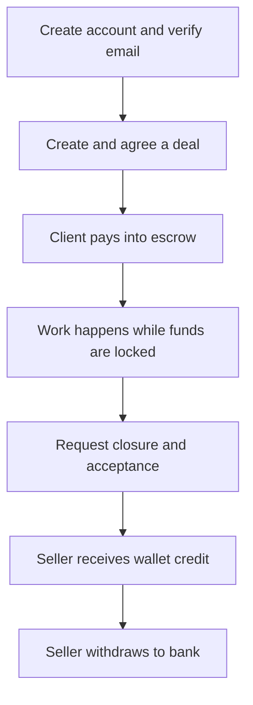
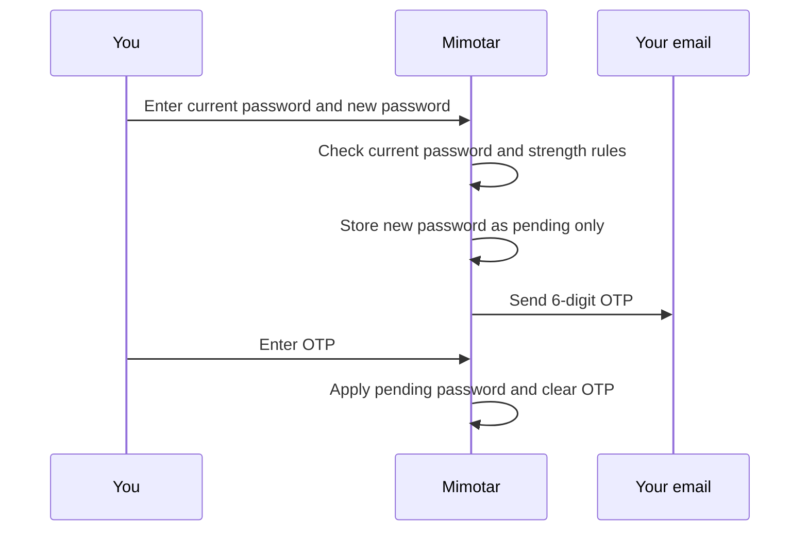
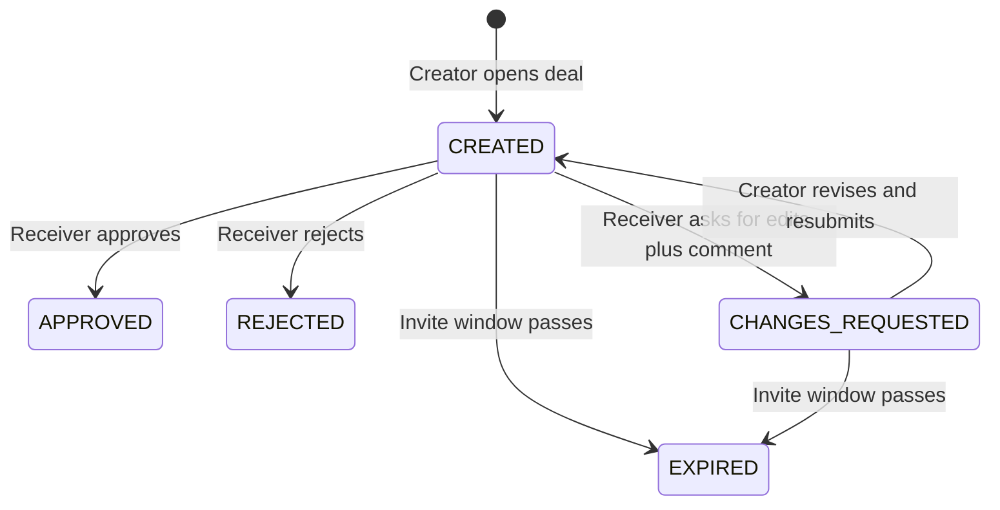
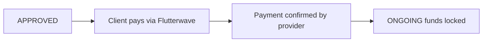
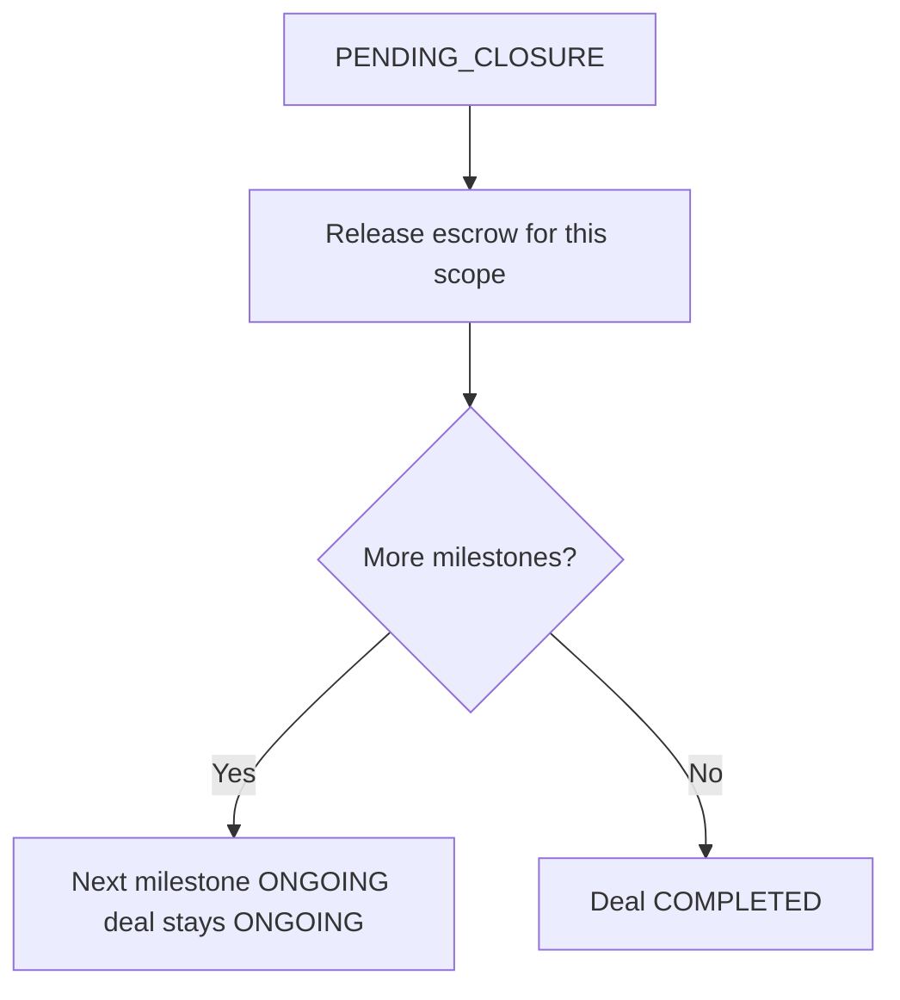
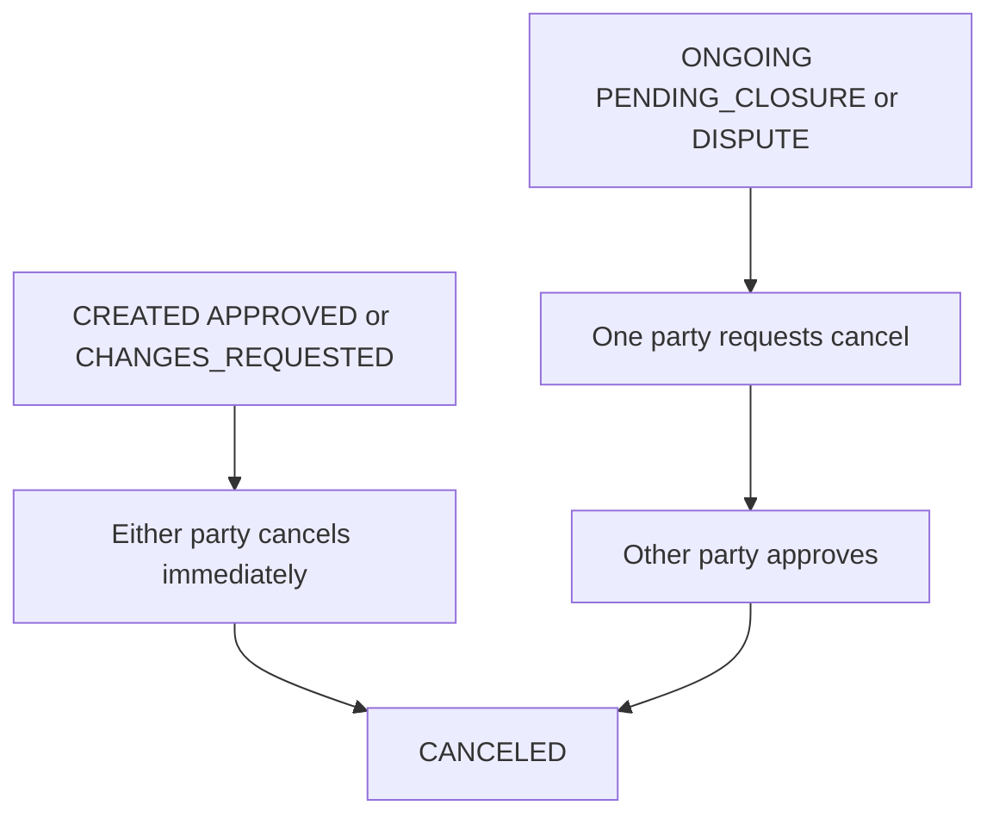
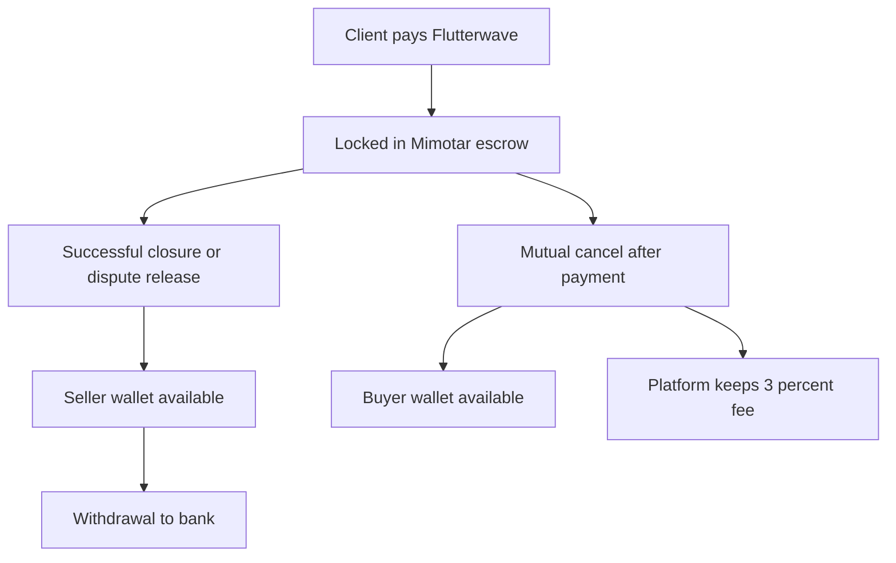
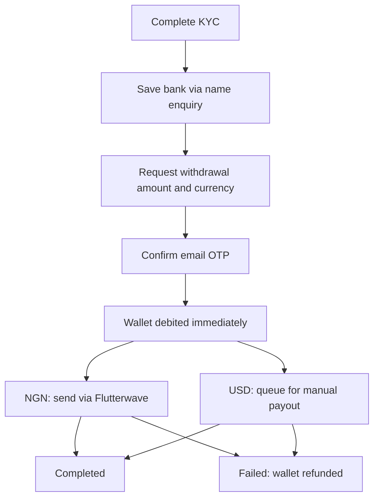
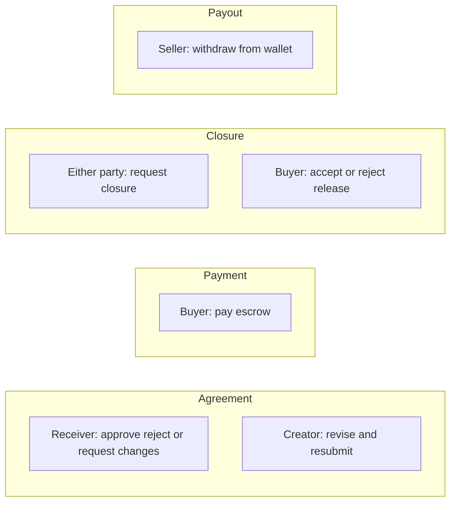

# Mimotar — How the Product Works

This guide explains Mimotar from a **user’s point of view**: what you do, what the system does next, what statuses mean, and how money moves. It is not an API reference.

If you build or integrate against the backend, technical endpoints live in Swagger at `/docs`.

---

## 1. What Mimotar is

Mimotar is an **escrow** platform for deals between a **client** (buyer of work or goods) and a **freelancer** (seller).

1. Both parties agree on the deal.
2. The **client pays into Mimotar** (escrow), not directly to the freelancer.
3. Work or delivery happens while funds are held safely.
4. When the client accepts (or the review window ends), Mimotar **releases money to the freelancer’s wallet**.
5. The freelancer can later **withdraw** wallet funds to their bank (naira automatically; dollars via a manual process).

Until release or a mutual cancel, the money is **locked in escrow**—it does not sit in either person’s withdrawable wallet yet.

---

## 2. Roles (who is who)

Three ideas matter. They overlap but are not the same.

| Idea | Meaning |
|------|---------|
| **Client / Freelancer** | Business role on the deal. The **client** pays; the **freelancer** receives payout after success. |
| **Creator / Receiver** | Who **opened** the ticket vs who was **invited** to approve it. Either role can be client or freelancer. |
| **Buyer / Seller** | Payment side: buyer = client; seller = freelancer. Used for “who pays escrow” and “who may approve release.” |

**Example:** A freelancer creates a ticket offering services and invites a client. The freelancer is **creator** and **seller**; the client is **receiver** and **buyer**.

---

## 3. Big picture

Alternate exits along the way include **reject before payment**, **request changes**, **dispute**, **cancel**, and **expiry**.

---

## 4. Account and security

### 4.1 Sign up and email verification

**You do:** Register with email and password (or sign in with an allowed social provider).

**System does:** Creates your account and expects **email verification** before some money-sensitive steps (for example adding a bank account and withdrawing).

**Outcome:** You can log in. Until email is verified, withdrawals and bank setup stay blocked.

### 4.2 Log in

**You do:** Sign in with your credentials.

**System does:** Issues a session/token so later actions know who you are.

### 4.3 Change password (while logged in)

This is a deliberate two-step flow so a stolen session alone cannot silently change your password without email access.

| Step | What happens | If it fails |
|------|----------------|-------------|
| Request | Current password must match; new password must meet strength rules and differ from the old one; OTP emailed | Wrong current password, weak password, OAuth-only account (no password), email send failure |
| Confirm | OTP must be correct and used within **15 minutes** | Wrong/expired OTP; you must request again |

### 4.4 Profile vs settings

**Profile** (who you are outwardly): display name, phone, address, city, country, postal code, ID number, avatar.

**Settings** (how the account behaves): default currency (NGN / USD / GBP preference), notification preference (email / SMS / both—preference only; SMS delivery is not fully wired for OTPs today), two-factor flag, account status, security questions.

Phone numbers can be saved on the profile. There is **no WhatsApp or SMS OTP verification** of phone numbers today. OTPs for security actions go to **email**.

---

## 5. Creating and agreeing a deal

### 5.1 Create a ticket (project)

**You (creator) do:** Describe the deal—title, amount, currency, roles, deadline, inspection period, who pays the escrow fee, optional files, and for milestone projects a list of milestones.

**System does:** Creates the ticket in status **`CREATED`**, builds an approval link, and waits for the other party.

**You see:** A pending deal waiting for the receiver.

**Possible issues:** Invalid milestones (must exist for milestone projects; deadlines cannot exceed the project deadline).

### 5.2 What the receiver can do while `CREATED`

| Action | New status | Meaning |
|--------|------------|---------|
| **Approve** | `APPROVED` | Terms accepted; client can pay. |
| **Reject** | `REJECTED` | Deal ends; no payment. |
| **Request changes** | `CHANGES_REQUESTED` | Terms not OK; you leave a **comment** for the creator. Deal is not dead. |

Approve/reject are only allowed from **`CREATED`** (after the system checks the invite has not expired).

### 5.3 Change-request loop

**Receiver requests changes**

- **Trigger:** Comment explaining what must change.
- **System:** Status → `CHANGES_REQUESTED`; stores the comment; notifies the creator.
- **Creator sees:** The feedback and can edit commercial terms (amount, title, description, terms, deadlines, fees, files, milestones)—not party emails/roles, currency, or deal type.

**Creator revises**

- Saves updates while still `CHANGES_REQUESTED` (does not yet ask for approval again).

**Creator resubmits**

- Status returns to **`CREATED`**; revision count increases; receiver is notified to approve again.
- Previous comment remains visible so the receiver can see what they asked for.

The receiver may approve, reject, or request changes again.

### 5.4 Expiry before money moves

If the deal is still **`CREATED`** or **`CHANGES_REQUESTED`**, or **`APPROVED` but unpaid**, and the invite/payment window (`expiresAt`) has passed, the system marks it **`EXPIRED`**. Funded deals are not expired this way.

---

## 6. Paying into escrow

Only a deal in **`APPROVED`** can be paid.

| Step | Detail |
|------|--------|
| **Who pays** | The **client (buyer)**. Total charged can include the **3% escrow fee** depending on who was set to pay the fee (client, freelancer, or split). |
| **When status becomes ONGOING** | Only after Mimotar receives a **successful payment confirmation** from Flutterwave (webhook). Manual “mark ongoing” is not used. |
| **What locks** | The deal amount (and for milestones, unfinished milestone amounts) counts as **locked escrow**, not withdrawable wallet balance. |
| **Milestones** | On first successful payment, **milestone 1** becomes active (`ONGOING`). |

**Failures:** Paying while not `APPROVED`, expired deal, already paid, or amount/currency mismatch with what was expected—all leave the deal unpaid / not `ONGOING`.

---

## 7. Working, closing, and completing

While **`ONGOING`** (or after a dispute path), work happens against the locked funds.

### 7.1 Request closure

**Someone on the deal** marks work ready for acceptance → status **`PENDING_CLOSURE`** (and the active milestone, if any, also moves to pending closure).

**System:** Starts a **48-hour** review window for the other party. Emails both sides.

### 7.2 Outcomes of pending closure

| Outcome | What happens |
|---------|----------------|
| **Buyer accepts release** | Escrow for that scope is released to the **seller’s wallet** (minus any seller fee share). |
| **Nobody acts for 48 hours** | System auto-completes the same release. |
| **Closure is rejected** | Deal (and milestone if any) move to **`DISPUTE`**. |

### 7.3 Ordinary deal vs milestones

- **Non-milestone:** One release → deal **`COMPLETED`**; seller wallet credited.
- **Milestone:** Each completed milestone pays that slice; the next milestone activates; the deal stays **`ONGOING`** until the last milestone is done, then **`COMPLETED`**.

Released money becomes **available withdrawable** balance in NGN or USD on the seller’s wallet (not locked escrow anymore).

---

## 8. Disputes and cancellation

### 8.1 Disputes

**When:** Typically during active funded work, pending closure, or related states.

**You do:** Open a dispute with reason, options, and optional evidence.

**System:** Deal (and active milestone if relevant) → **`DISPUTE`**.

**Paths out:**

- **Cancel the dispute** (by the opener, while ongoing) → back toward **`ONGOING`**.
- **Buyer approves release** despite the dispute → escrow released like a normal settlement; dispute closed.

### 8.2 Cancel the whole deal

| Stage | How cancel works | Money |
|-------|------------------|--------|
| **Not paid yet** | Either party can cancel **immediately** (no counter-approval). | Nothing to refund. |
| **Already paid (funded)** | One party **requests** cancel; the **other must approve**. | Client is refunded to **wallet** for what they paid **minus the 3% platform fee** (fee is kept). Payment marked refunded. Open milestones canceled; open disputes canceled. |

If the other party **rejects** a cancel request, the deal continues as before.

---

## 9. Money map (read this carefully)

| Bucket | Meaning |
|--------|---------|
| **Locked escrow** | Paid deals still `ONGOING` / `PENDING_CLOSURE` / `DISPUTE`. Not withdrawable. |
| **Available wallet** | Released earnings or cancel refunds already credited to you. |
| **Platform fee** | On mutual cancel after payment, **3% of the deal amount** stays with Mimotar; the rest returns to the buyer’s wallet. |

---

## 10. Dashboard and your projects

### 10.1 Dashboard (home summary)

When you open the dashboard you get a snapshot:

| Section | What it tells you |
|---------|-------------------|
| **Available withdrawable** | NGN and USD in your wallet. |
| **Locked escrow** | Your share of funds still tied up in active funded deals. |
| **Actions required** | Things waiting on **you** (approve a deal, revise after feedback, pay escrow, accept/reject closure, answer cancel request, respond to dispute). |
| **Active contracts** | Funded deals in flight, with counterparty and active milestone if any. |
| **Recent activity** | Latest notifications (title, description, time). |

Older summary counts (totals, disputes, monthly earnings chart) remain as well.

### 10.2 Projects list

A searchable, paginated list of **every deal where you are creator or receiver**, including **completed** ones.

You can filter by:

- Text search on title/description  
- One or many statuses (including `COMPLETED`)  
- Exact or min/max **amount**

Each row includes the full deal detail plus handy labels: **your role**, **counterparty**, **due date**, and for milestone deals **which milestone is active out of how many**.

---

## 11. Identity (KYC), bank account, and withdrawals

Withdrawing is gated more strictly than browsing deals.

### 11.1 Prerequisites

1. **Email verified**
2. **Identity KYC verified** (Prembly—e.g. NIN/BVN in Nigeria, plus other country channels)
3. For **NGN** payouts: a **saved Nigerian bank account** whose resolved account name **soft-matches** your KYC legal name (titles and middle-name differences are tolerated; unrelated names are rejected)

### 11.2 Withdrawal flow

| Rule | Detail |
|------|--------|
| **Minimums** | **₦5,000** NGN · **$50** USD |
| **OTP** | Required on **every** withdrawal; valid **15 minutes** |
| **When money leaves the wallet** | On OTP confirm (reserved immediately) |
| **NGN** | Automatic bank transfer; if the provider fails (or webhook reports failure), status → failed and **wallet is refunded** |
| **USD** | Goes to **pending manual** for Mimotar ops to pay outside the automated rail; admin completes or fails (fail refunds you) |
| **One in flight** | You cannot start another withdrawal while one is processing or pending manual |

**Security notes for you:** OTPs arrive by email; protect your inbox. Admin completion of USD payouts is restricted to Mimotar operators (not ordinary user logins).

---

## 12. Who can act at each stage

| Moment | Typical actor |
|--------|----------------|
| Approve / reject / request changes | **Receiver** |
| Revise / resubmit | **Creator** |
| Pay escrow | **Buyer (client)** |
| Accept escrow release | **Buyer** |
| Open dispute | Either participant (with an account) |
| Approve mutual cancel (funded) | The party who did **not** request cancel |
| Withdraw | **Seller** (or anyone with wallet credit, e.g. buyer after cancel refund) |

---

## 13. Status cheat-sheet (deals)

| Status | Plain meaning | What you usually do next |
|--------|---------------|---------------------------|
| `CREATED` | Waiting for receiver agreement | Receiver: approve, reject, or request changes |
| `CHANGES_REQUESTED` | Receiver asked for edits | Creator: revise and resubmit |
| `APPROVED` | Agreed; unpaid | Buyer: pay into escrow |
| `ONGOING` | Paid; work in progress | Deliver work; later request closure |
| `PENDING_CLOSURE` | Waiting for acceptance / 48h auto | Buyer: accept or reject; or wait |
| `DISPUTE` | Conflict opened | Talk / evidence; cancel dispute or release |
| `COMPLETED` | Finished; escrow released for the deal | Seller may withdraw wallet funds |
| `REJECTED` | Receiver refused before payment | Nothing; create a new deal if needed |
| `EXPIRED` | Invite/payment window lapsed unpaid | Recreate or renegotiate |
| `CANCELED` | Parties stopped the deal | Check wallets if a funded cancel refunded the buyer |

---

## 14. Typical happy path (story form)

1. **Amaka** (client) and **Tunde** (freelancer) agree offline. Tunde creates a Mimotar ticket as creator/freelancer and invites Amaka.
2. Amaka reviews terms. She requests a lower price with a comment → `CHANGES_REQUESTED`.
3. Tunde updates the amount and resubmits → `CREATED` again. Amaka **approves** → `APPROVED`.
4. Amaka **pays** through Mimotar’s payment page. When payment is confirmed → `ONGOING`; funds are locked.
5. Tunde delivers. Either party requests closure → `PENDING_CLOSURE`.
6. Amaka **accepts**. Mimotar credits Tunde’s **NGN wallet**. Deal → `COMPLETED`. Locked escrow for that deal drops.
7. Tunde already finished KYC and saved his bank. He requests a withdrawal of ₦20,000, enters the email OTP, and Mimotar sends the transfer. When it succeeds, the money leaves his wallet to his bank.

If they had used **USD**, after OTP the withdrawal would wait for Mimotar’s operations team instead of an instant bank push.

---

## 15. Glossary

| Term | Meaning |
|------|---------|
| **Escrow** | Money held by Mimotar until the agreed release or cancel rules apply. |
| **Locked escrow** | Paid funds still tied to an active deal. |
| **Wallet / available balance** | Money already released or refunded to you; eligible to withdraw (subject to KYC/bank rules). |
| **Milestone** | A priced slice of a larger project, paid as each slice completes. |
| **OTP** | One-time password sent to email for sensitive actions. |
| **KYC** | Identity check (government ID / BVN / etc.) required before banking and withdrawals. |
| **Soft name match** | Bank account name must reasonably match your verified legal name, not necessarily character-identical. |

---

## 16. What this guide does not cover

- Pixel-level UI layout (that depends on the frontend app).
- Admin-only tools for paying USD withdrawals (internal operations).
- Full legal terms of service.

For engineers integrating with the backend, use Swagger at **`/docs`**.

---

*This document describes Mimotar’s product behavior as implemented in the backend. If product rules change, this guide should be updated to match.*
